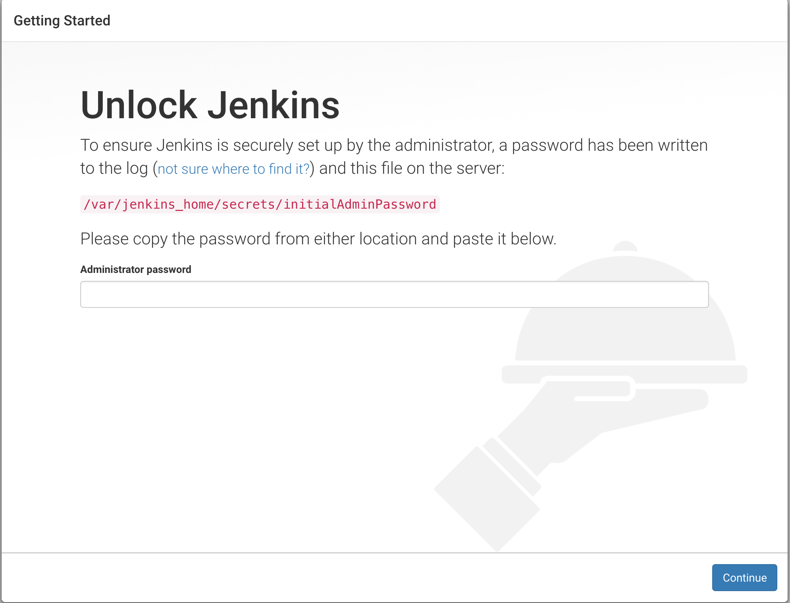
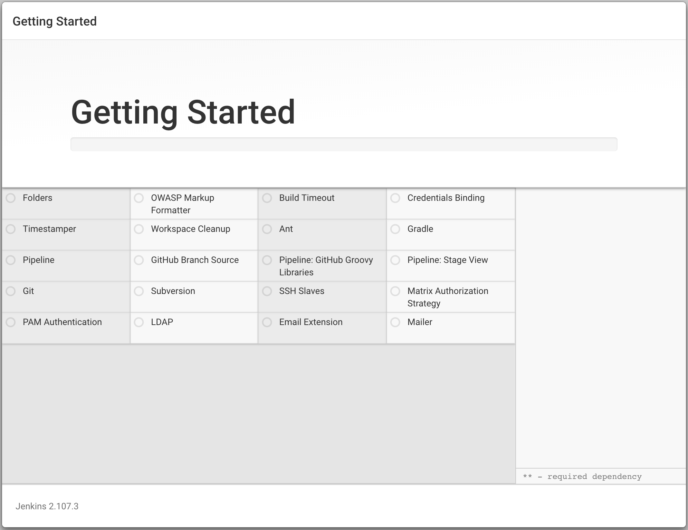
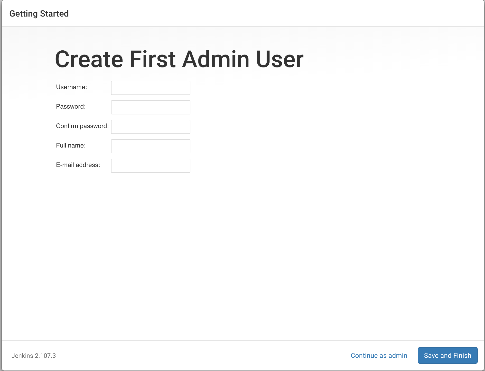
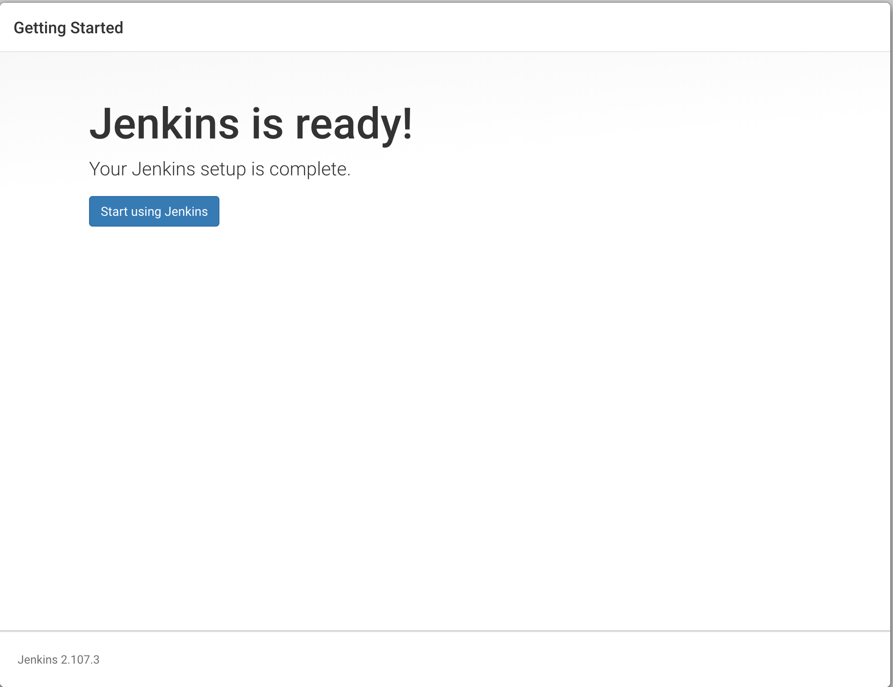
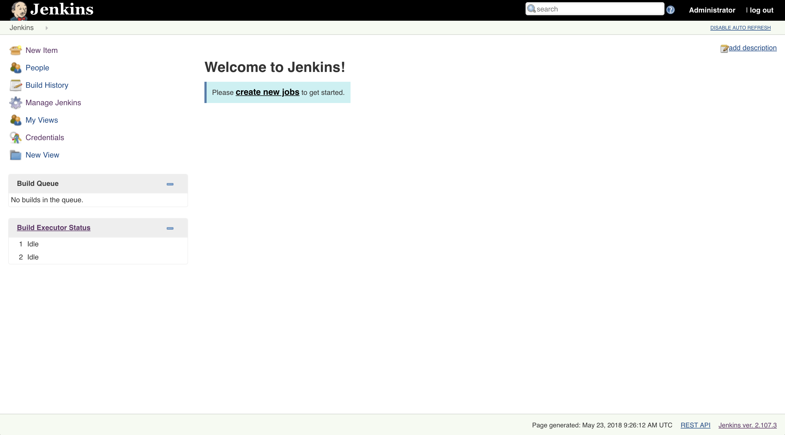

## Install Jenkins

Jenkins 是开源的持续集成、持续交付工具；

## 拉取 Jenkins 镜像，启动 Jenkins 容器

```
docker pull jenkins/jenkins:lts
docker run -p 8080:8080 -p 50000:50000 jenkins/jenkins:lts
```

## Unlock Jenkins

打开浏览器，在浏览器中输入 IP:8080 端口（jenkins 默认启动8080端口）访问 Jenkins 安装程序；默认第一次访问 Jenkins 将进入解锁界面，当然只有拥有管理员权限的用户（只有管理员才可以查看到initialAdminPassword 密码）才可以进入下一步操作（安全）；



**方法一: 控制台日志查看解锁密码**

```
docker logs jenkins
```

**方法二：查看容器中的 `initialAdminPassword` 文件**

使用 docker exec 的方式查看容器内的文件

```
docker exec -it jenkins cat /var/jenkins_home/secrets/initialAdminPassword
3b1b310d77a84bd382ab5699b2f2f8dd
```

输入管理密码，点击进入下一步。

## Getting Started（Customize Jenkins）

Jenkins 插件安装，Jenkins 的优秀在于社区提供了丰富的插件来不断完善功能，此处选择安装插件。

Install suggested plugins: 如果是新用户，建议选择安装推荐插件；
Select plugins to install: 如果你比较了解 Jenkins，可以选择自定义安装插件

在此我选择安装推荐插件



下一步，继续。

## Create First Admin User

插件安装完成后，将进入创建管理员界面，输入管理员账号/密码，点击 Finish



## Jenkins is ready 

点击 start using Jenkins 即可启动 Jenkins，进入 jenkins 首页;



## Welcome to Jenkins

至此，Jenkins 即安装完成。



[下一步：配置示例](install-jenkins.md)

## 参考文档

https://hub.docker.com/r/jenkins/jenkins/
https://github.com/jenkinsci/docker/blob/master/README.md
